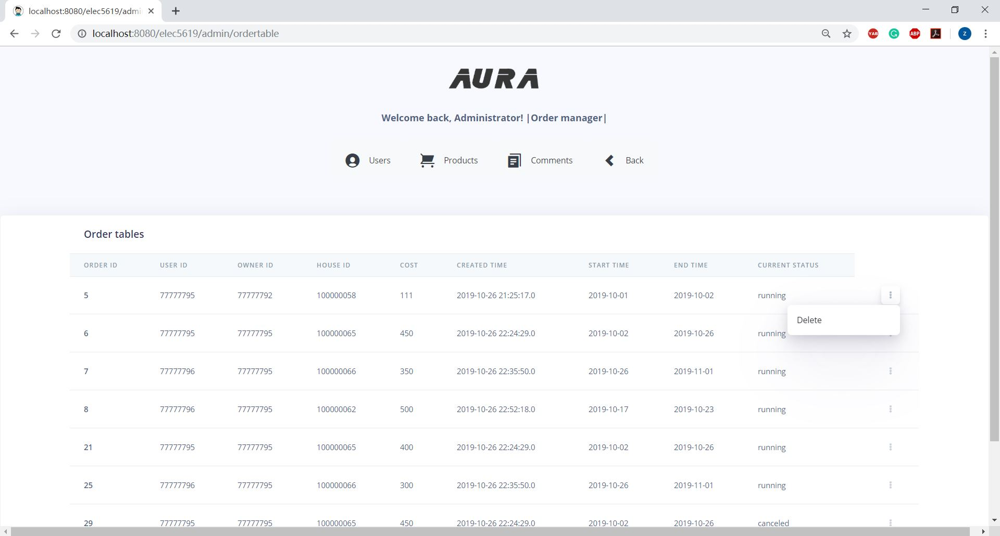
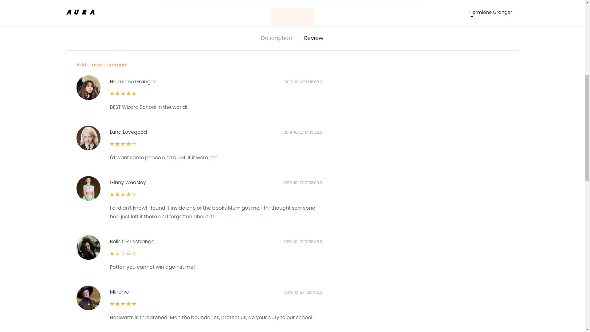

# AURA

AURA is aim at creating a website that can provide a platform to share information related to rentals. The main source of information is created by users. As a landlord, users can create a rental subpage at AURA by providing basic information such as address, image and price. As a tenant, users can use filters to find listings, browse home information, communicate with landlords, place orders and view order details. For convenience, users do not need to register separate accounts for the identity of the landlord and the tenant, but a unified account.

- [Features](#features)
- [Installation](#installation)
- [Usage](#usage)
  * [Admin Page](#admin-page)
  * [Collection and Search Page](#collection-and-search-page)
  * [House Host Page](#house-host-page)
  * [House Detail and Comments](#house-detail-and-comments)
  * [Profile Edit Page](#profile-edit-page)
  * [My Order & House Page](#my-order---house-page)
- [File Manifest](#file-manifest)


# Features

- Account register and login
- User Profile modification
- Explore the collection of the houses
- Search for houses in certain locations and time period
- Upload images of users and houses
- Host a house for landlords
- Desciption page for single house
- Create and manage orders
- Post comments by users
- Background management for administrator
  - High-previllage modification on houses and users (password not modificatable)
  - Delete orders and comments

# Installation

**Step 1 File upload path modification:  **

In `DatabaseProductManager.java` line 91 and `UserManagerService.java` line 108, you will need to change the address to your own foler address where keep the uploaded files.

```java
public void savemyPhoto(String id, MultipartFile file) {
  	...
	String pathroot="YOUR_UPLOAD_FOLDER_ADDRESS";
	String path ="resources/images/"+"house-"+ id+".jpg";
	...
	}
```

**Step 2 Set external module:  **

In the server setting, adding external web module which has the document base of the upload path set in the previous and link to the path of `/resources/images`

**Step 3 Database connection:**

In `/src/main/resources/database.properties` file, you will have to change the “jdbc.databaseName”, “jdbc.uesrname” and “jdbc.password” to your own database.

```
jdbc.databaseName=DATABASE_NAME
jdbc.url=jdbc:mysql://localhost:3306/DATABASE_NAME?useUnicode=true&characterEncoding=UTF-8&zeroDateTimeBehavior=convertToNull
jdbc.username=root
jdbc.password=DATABASE_PASSWORD
```

# Usage

## Admin Page

1.  Administrator Logging In


​		In the log in page, fill in the account and password "username: admin, password: adminnb" then you 		will successfully enter the Administrator Manager. The Administrator's home page is shown below.


​		In this Administrator home page you can access different tables in the database by clicking buttons in 		the center of the home page. You can return to this page in all subpages.

2. Product Manager 

   By clicking the "Products" you can enter the product manager, in this page you can enter other subpages and go back to Admin home page.

   All the products will be listed in the product table, the visible values are product ID, product name, owner ID, product location, house type, price per week, available rooms, available parking places and current product status. 


​		By clicking the button on the right you can choose edit or delete the chosen product. You will enter the 		product edit page by clicking edit button. By clicking the delete button, the chosen product will be 		 		deleted.


​		In the edit page you can edit the contents shown in the table, the location in the table is not allowed to 		change. Once clicking the done button, the values will be submitted to database and you will return to 		the product manager page. If you click cancel button, you can go back to the product manager page.

3. User Manager

   By clicking the "Users" you can enter the user manager, in this page you can enter other subpages and go back to Admin home page.

   All the users will be listed in the user table, the visible values are user ID, user name, user's email address, user's phone number and user's real name.


​		By clicking the button on the right you can choose edit or delete the chosen user. You will enter the 		user edit page by clicking edit button. By clicking the delete button, the chosen user will be deleted.


​		In the edit page you can edit the contents shown in the table. Once clicking the done button, the values 		will be submitted to database and you will return to the user manager page. If you click the cancel       	    button, you can go back to the user manager page.

4. Order Manager 

   By clicking the "Orders" you can enter the order manager, in this page you can enter other subpages and go back to Admin home page.

   All the orders will be listed in the order table, the visible values are order ID, user ID, owner ID, house ID, cost per week, order created time, order start date, order end date and current order status. 



​		By clicking the button on the right you can delete the chosen order. By clicking the delete button, the 		chosen order will be deleted.

5. Comment Manager

   By clicking the "Comments" you can enter the comment manager, in this page you can enter other subpages and go back to Admin home page.

   All the comments will be listed in the comment table, the visible values are comment ID, user ID, product ID, comment contents, scores and comment created time. 


​		By clicking the button on the right you can delete the chosen comment. By clicking the delete button, 		the chosen comment will be deleted.

## Collection and Search Page 

User can explore the collection of houses and type the wanted information in the hello page to search for certain houses. The Google Map Place API will help to fill the location blank. When mouse hover in location, the map of location will display.


Search Result will be displayed on another view. User can change the location to search again while remaining the date.


## House Host Page

After select the "host a house" buttom on the home page, user can add basic information, for example, House Name, Location (contain google map api to normalizate the address), price, description (use text type to get long field text), etc. 


After clicking the "Add" button, user can now upload photos in the photo upload page. User can upload three photos to show house image. if less than three photos being uploaded, there will be a alert to make sure user meet the photo quantitative requirement.  


## House Detail and Comments

1. house info page 

   

   This page will show the description and house details in the description area. Users can choose the order-begin and order-end dates on the page, and by clicking the button " order" to make an order.

   

   The location will be shown with  google-map API. 

   

   All the comments which including the comment and score will be shown in the comment area. Users can add a comment by clicking the button "add a comment ".

   

   

2. comment page

   

   Users can edit the comment, including  giving a score with clicking the stars and providing review of the house. 


## Profile Edit Page

After logging in, user can check and edit their personal information and reset password. Besides, user can jump to the avatar edit page by cliking the image.


In the avatar edit page, user can upload a new avatar from computer.


## My Order & House Page

Order management page is designed for users to view and edit current orders with limited modification rights. Both running orders and canceled orders will be shown here.


House management page is designed for users to check or delete houses they have hosted. User can also check and edit orders under their houses.


# File Manifest

├─src
│  ├─main
│  │  ├─java
│  │  │  └─au
│  │  │      └─usyd
│  │  │          └─elec5619
│  │  │              ├─dao
│  │  │              │      CommentAdminManagerDAO.java
│  │  │              │      OrderAdminManagerDAO.java
│  │  │              │      ProductAdminManagerDAO.java
│  │  │              │      UserAdminManagerDAO.java
│  │  │              │      UserManagerDAO.java
│  │  │              │      
│  │  │              ├─domain
│  │  │              │      Comment.java
│  │  │              │      Order.java
│  │  │              │      Product.java
│  │  │              │      User.java
│  │  │              │      
│  │  │              ├─service
│  │  │              │      CommentAdminManager.java
│  │  │              │      CommentAdminManagerService.java
│  │  │              │      CommentManager.java
│  │  │              │      DatabaseOrderManager.java
│  │  │              │      DatabaseProductManager.java
│  │  │              │      OrderAdminManager.java
│  │  │              │      OrderAdminManagerService.java
│  │  │              │      OrderManager.java
│  │  │              │      ProductAdminManager.java
│  │  │              │      ProductAdminManagerService.java
│  │  │              │      ProductManager.java
│  │  │              │      SimpleCommentManager.java
│  │  │              │      UserAdminManager.java
│  │  │              │      UserAdminManagerService.java
│  │  │              │      UserManager.java
│  │  │              │      UserManagerService.java
│  │  │              │      
│  │  │              └─web
│  │  │                      AdminCommentController.java
│  │  │                      AdminController.java
│  │  │                      AdminInterceptor.java
│  │  │                      AdminOrderController.java
│  │  │                      AdminProductController.java
│  │  │                      AdminUserController.java
│  │  │                      CommentController.java
│  │  │                      HomeController.java
│  │  │                      InventoryController.java
│  │  │                      LoginInterceptor.java
│  │  │                      MyAccountController.java
│  │  │                      ProductController.java
│  │  │                      UserController.java
│  │  │                      
│  │  ├─resources
│  │  │  │  database.properties
│  │  │  │  log4j.xml
│  │  │  │  
│  │  │  └─META-INF
│  │  └─webapp
│  │      ├─resources
│  │      │  ├─admin
│  │      │  │  └─resources
│  │      │  │      ├─css
│  │      │  │      │      
│  │      │  │      ├─demo
│  │      │  │      │      
│  │      │  │      ├─fonts
│  │      │  │      │      
│  │      │  │      ├─img
│  │      │  │      │          
│  │      │  │      ├─js
│  │      │  │      │                  
│  │      │  │      └─scss
│  │      │  │                           
│  │      │  ├─css
│  │      │  │             
│  │      │  ├─fonts
│  │      │  │        
│  │      │  ├─images
│  │      │  │         
│  │      │  ├─js
│  │      │  │          
│  │      │  ├─scss
│  │      │  │               
│  │      │  └─user
│  │      │                           
│  │      └─WEB-INF
│  │          │  web.xml
│  │          │  
│  │          ├─classes
│  │          │      messages.properties
│  │          │      
│  │          ├─spring
│  │          │  │  root-context.xml
│  │          │  │  
│  │          │  └─appServlet
│  │          │          persistence-context.xml
│  │          │          servlet-context.xml
│  │          │          
│  │          └─views
│  │                  add.jsp
│  │                  AdminCommentTable.jsp
│  │                  AdminHome.jsp
│  │                  AdminOrderEditPage.jsp
│  │                  AdminOrderTable.jsp
│  │                  AdminProductEditPage.jsp
│  │                  AdminProductTable.jsp
│  │                  AdminUserEditPage.jsp
│  │                  AdminUserTable.jsp
│  │                  commentlist.jsp
│  │                  commentpage.jsp
│  │                  hello.jsp
│  │                  home.jsp
│  │                  include.jsp
│  │                  index.jsp
│  │                  login.jsp
│  │                  myorder.jsp
│  │                  myphoto.jsp
│  │                  myprofile.jsp
│  │                  register.jsp
│  │                  search.jsp
│  │                  uploadphoto.jsp
│  │                  
│  └─test
│      ├─java
│      │  └─au
│      │      └─usyd
│      │          └─elec5619
│      │              └─web
│      │                      InventoryControllerTest.java
│      │                      
│      └─resources
│              log4j.xml
│              
└─target
    ├─classes
    │  │  database.properties
    │  │  log4j.xml
    │  │  
    │  └─au
    │      └─usyd
    │          └─elec5619
    │              ├─dao
    │              │      CommentAdminManagerDAO.class
    │              │      OrderAdminManagerDAO$statusKind.class
    │              │      OrderAdminManagerDAO.class
    │              │      ProductAdminManagerDAO.class
    │              │      UserAdminManagerDAO.class
    │              │      UserManagerDAO.class
    │              │      
    │              ├─domain
    │              │      Comment.class
    │              │      Order$orderStatus.class
    │              │      Order.class
    │              │      Product$range.class
    │              │      Product$statusKind.class
    │              │      Product$type.class
    │              │      Product.class
    │              │      User.class
    │              │      
    │              ├─service
    │              │      CommentAdminManager.class
    │              │      CommentAdminManagerService.class
    │              │      CommentManager.class
    │              │      DatabaseOrderManager$statusKind.class
    │              │      DatabaseOrderManager.class
    │              │      DatabaseProductManager$statusKind.class
    │              │      DatabaseProductManager.class
    │              │      OrderAdminManager.class
    │              │      OrderAdminManagerService.class
    │              │      OrderManager.class
    │              │      ProductAdminManager.class
    │              │      ProductAdminManagerService.class
    │              │      ProductManager.class
    │              │      SimpleCommentManager.class
    │              │      UserAdminManager.class
    │              │      UserAdminManagerService.class
    │              │      UserManager.class
    │              │      UserManagerService.class
    │              │      
    │              └─web
    │                      AdminCommentController.class
    │                      AdminController.class
    │                      AdminInterceptor.class
    │                      AdminOrderController.class
    │                      AdminProductController.class
    │                      AdminUserController.class
    │                      CommentController.class
    │                      HomeController.class
    │                      InventoryController.class
    │                      LoginInterceptor.class
    │                      MyAccountController.class
    │                      ProductController.class
    │                      UserController.class
    │                      
    ├─m2e-wtp
    │  └─web-resources
    │      └─META-INF
    │          │  MANIFEST.MF
    │          │  
    │          └─maven
    │              └─au.usyd
    │                  └─elec5619
    │                          pom.properties
    │                          pom.xml
    │                          
    └─test-classes
        │  log4j.xml
        │  
        └─au
            └─usyd
                └─elec5619
                    └─web
                            InventoryControllerTest.class
                            